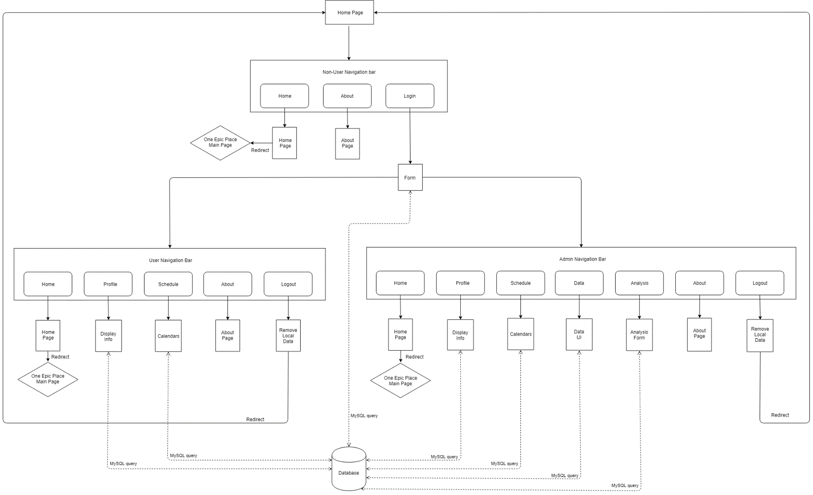
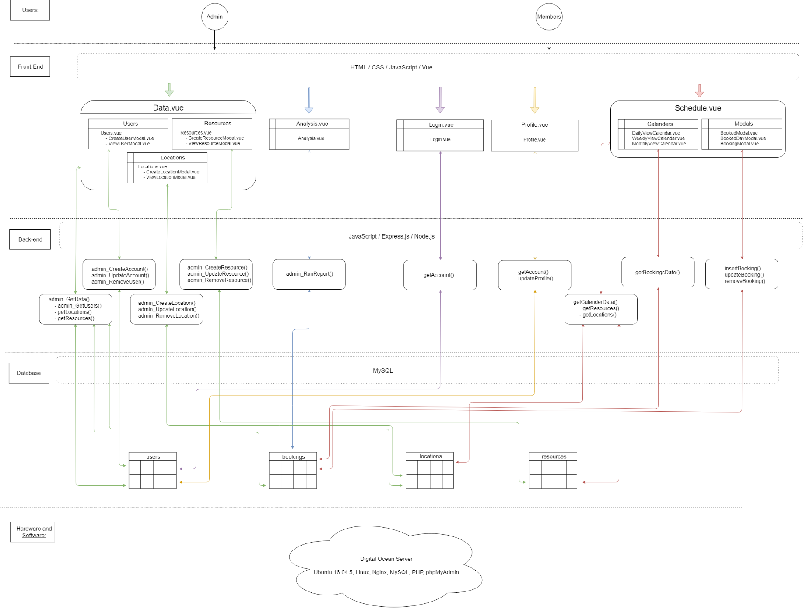

# One Epic Place Website Extension

## About ##
The One EPIC Place Scheduling Web Application is a web-based scheduler to help both the clients and the staff. 
The clients can use the application to view a schedule to see the availability of locations and to rent rooms from the business using a friendly intuitive interface.
The staff can use the application to manage the rented locations by holding administrator privileges allowing for editing and removal of client made bookings. The application also serves as a data analysis platform to view data on the clients, locations, and provided resources that they are renting to help price the services and better accommodate the clients.

  - Allows users to interact with the application API with restricted privileges:
    -	View the renting availability.
    -	Book locations at available times.
    -	View offered accommodations (locations and resources).

  -	Let staff hold administrator level privileges in the site letting them:
    -	Create accounts.
    -	View the renting availability.
    -	View and edit booking data with sorting functions.
    -	View and edit client accounts.
    -	View and edit offered accommodations (locations and resources).

This Scheduling Application is being made as a competitor against YArooms, another web-based scheduler that holds many of the same features as this application but does not have as many data analytic features as this application.
This application has business tailored features such as allowing clients to list the noise level of their meeting as well making it a more suitable choice for the business.

## Tech ##

Application:
- HTML – Used to structure the web pages.
-	CSS – Used to style the HTML.
-	JavaScript – Used to make the pages interactive.
-	Vue – Used to structure the JavaScript.
-	Express – A JavaScript backend framework to run on a server that accepts requests and responds back to allow the API to interact with the server to interact with the database.
-	Node – A runtime to run the Express.js framework inside of.
-	MySQL – Used to statically store information for later reference.

Cloud Server (LEMP Stack):
-	Linux – Operating system to manage the hardware and to run the other software.
-	Nginx – A web server that is run to host the application.
-	MySQL – A relational database management database system.
-	PHP – A general purpose programming language installed to allow installed software to compile.
-	phpMyAdmin – A PHP based UI to assist in interacting with the MySQL Database.

## Design ##

## Architecture ##

